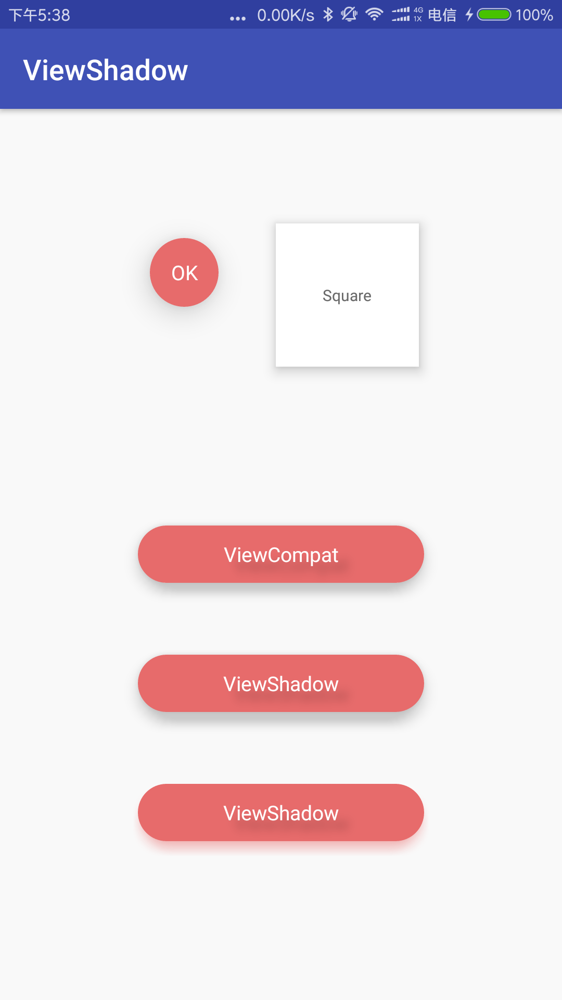

# ViewShadow

视图阴影效果加载工具（低版本兼容 Android API 15 And Above.）

## Usage

```groovy
compile 'com.github.looa:ViewShadow:1.1.0'
```

## Intro
ViewShadow是能为Android应用中任意视图加载阴影效果的工具类。
<br>
ViewShadow is a simple class you can use in your Android application
to load shadows for your view.
<br>
<br>
注意，该工具只支持渲染阴影，并不支持高度设定。
 
Sample
-----
 
 

Quick Start
-----
 

```java
public class MyActivity extends Activity {
    public void onCreate(Bundle savedInstanceState) {
        super.onCreate(savedInstanceState);
        // Set content view, etc.
        ViewShadow.setElevation(view, elevation);
        ViewShadow.setElevation(view, elevation, color);
    }
}
 ```


Please refer to the documentation in ViewServer.java for more info.
